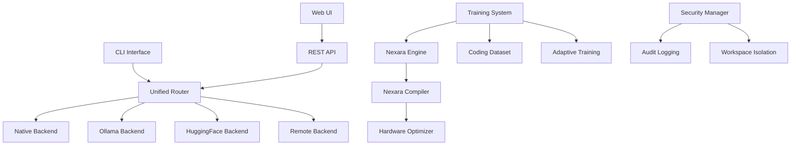

# InferForge Documentation

<div align="center" style="margin: 2rem 0;">
  
  <h1>InferForge</h1>
  <p><strong>Faster local LLMs. Forge them. Run them.</strong></p>
</div>

## What is InferForge?

InferForge is a **local model runtime** with its own coding model — **InferForge beta** — trained on an Ollama base with a coding + agent curriculum. It provides a complete solution for:

- 🚀 **Fast Inference**: Optimized execution with multiple backend support
- 🎯 **Smart Training**: AI-native Nexara language for model customization
- 🛠️ **Agent Tools**: Built-in file operations, command execution, and web requests
- 🔒 **Secure by Default**: Workspace isolation, audit logging, and permission management
- 📊 **Real-time Monitoring**: Track training progress, GPU usage, and system metrics

## Key Features

### Multiple Inference Backends

InferForge intelligently selects the best backend for your model:

- **Native**: Direct GGUF execution with llama.cpp
- **Ollama**: Seamless integration with Ollama models
- **HuggingFace**: Full transformers support with quantization
- **Remote**: Connect to cloud inference endpoints

### Nexara Training Language

Train models with an AI-native language designed for clarity:

```nexara
@nexara
model CustomCoder {
    base: "qwen2.5-coder:7b"
    task: "code-completion"
    
    training {
        epochs: 3
        batch_size: 4
        learning_rate: 0.0001
        optimizer: "adamw"
    }
    
    hardware {
        prefer_gpu: true
        mixed_precision: true
    }
}
```

### InferForge Beta - Your Coding Assistant

InferForge beta is trained to:

- Write production-quality code
- Create, edit, and manage files
- Run commands and tests
- Debug and refactor code
- Provide coding guidance

## Quick Example

### Installation

=== "pip"
    ```bash
    pip install inferforge
    ```

=== "from source"
    ```bash
    git clone https://github.com/inferforge/inferforge.git
    cd inferforge
    pip install -e .
    ```

### Import Models

```bash
forge import ollama
```

### Train InferForge Beta

```bash
forge train
```

### Start Chatting

```bash
forge chat
```

## Use Cases

### 🎓 Learning & Development

Perfect for learning AI/ML concepts and building coding skills with a local, private assistant.

### 💼 Professional Development

Use InferForge beta as your coding companion for:
- Code reviews and refactoring
- Test generation
- Documentation writing
- Bug fixing

### 🔬 Research & Experimentation

Train custom models for:
- Domain-specific tasks
- Novel architectures
- Performance optimization
- Ablation studies

### 🏢 Enterprise Deployment

Deploy InferForge in your infrastructure:
- Air-gapped environments
- On-premise servers
- Edge devices
- Development workstations

## Architecture Overview



## Community & Support

- 📖 [Documentation](https://inferforge.github.io/inferforge)
- 💬 [Discord Community](https://discord.gg/inferforge)
- 🐛 [Issue Tracker](https://github.com/inferforge/inferforge/issues)
- 📧 [Email Support](mailto:support@inferforge.dev)

## Next Steps

<div class="grid cards" markdown>

- :material-rocket-launch: **[Quick Start Guide](getting-started/quickstart.md)**
  
  Get up and running in 5 minutes

- :material-code-braces: **[CLI Commands](guide/cli-commands.md)**
  
  Learn all available commands

- :material-school: **[Training Tutorial](tutorials/first-model.md)**
  
  Train your first custom model

- :material-api: **[API Reference](api/rest.md)**
  
  Integrate InferForge in your apps

</div>

## License

InferForge is open source software licensed under the [MIT License](about/license.md).

---

<div align="center">
  <p>Made with ❤️ by the InferForge Team</p>
  <p>
    <a href="https://github.com/inferforge/inferforge">GitHub</a> •
    <a href="https://discord.gg/inferforge">Discord</a> •
    <a href="https://twitter.com/inferforge">Twitter</a>
  </p>
</div>
